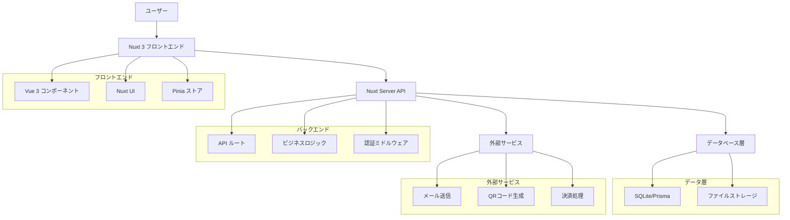

# 設計文書

## 概要

チケット管理システムは、Nuxt 3を基盤としたフルスタックWebアプリケーションとして設計されます。フロントエンドはVue 3とNuxt UIを使用し、バックエンドはNuxtのサーバーAPIを活用します。データベースはSQLiteを使用してローカル開発を簡素化し、本番環境では他のデータベースに移行可能な設計とします。

## アーキテクチャ

### システム構成



### 技術スタック

- **フロントエンド**: Nuxt 3, Vue 3, TypeScript, Nuxt UI
- **バックエンド**: Nuxt Server API, Nitro
- **データベース**: SQLite (開発), Prisma ORM
- **認証**: OAuth 2.0 (表面) + SIWE (Sign-In with Ethereum)
- **Web3**: ethers.js, SIWE ライブラリ
- **ゼロ知識証明**: circomlib, snarkjs
- **ファイル処理**: QRコード生成ライブラリ
- **スタイリング**: Tailwind CSS (Nuxt UI経由)

## コンポーネントとインターフェース

### フロントエンドコンポーネント

#### ページコンポーネント
- `pages/index.vue` - イベント一覧ページ
- `pages/events/[id].vue` - イベント詳細ページ
- `pages/purchase/[id].vue` - チケット購入ページ
- `pages/tickets/[id]/questions.vue` - チケット質問設定ページ
- `pages/my-tickets.vue` - マイチケットページ
- `pages/admin/dashboard.vue` - 管理者ダッシュボード
- `pages/admin/events/create.vue` - イベント作成ページ
- `pages/admin/events/[id]/edit.vue` - イベント編集ページ
- `pages/admin/events/[id]/report.vue` - 販売レポートページ
- `pages/staff/scanner.vue` - チケット検証ページ
- `pages/staff/verification.vue` - ゼロ知識証明検証ページ

#### 共通コンポーネント
- `components/EventCard.vue` - イベントカード表示
- `components/TicketCard.vue` - チケット表示
- `components/QRCodeDisplay.vue` - QRコード表示
- `components/PurchaseForm.vue` - 購入フォーム
- `components/EventForm.vue` - イベント作成・編集フォーム
- `components/SalesChart.vue` - 売上グラフ
- `components/QRScanner.vue` - QRコードスキャナー
- `components/QuestionSetup.vue` - チケット質問設定
- `components/AnswerForm.vue` - 質問回答フォーム
- `components/ZKVerification.vue` - ゼロ知識証明検証

#### レイアウトコンポーネント
- `layouts/default.vue` - 一般ユーザー向けレイアウト
- `layouts/admin.vue` - 管理者向けレイアウト
- `layouts/staff.vue` - スタッフ向けレイアウト

### APIエンドポイント

#### イベント管理
- `GET /api/events` - イベント一覧取得
- `GET /api/events/[id]` - イベント詳細取得
- `POST /api/events` - イベント作成
- `PUT /api/events/[id]` - イベント更新
- `DELETE /api/events/[id]` - イベント削除

#### チケット管理
- `POST /api/tickets/purchase` - チケット購入
- `GET /api/tickets/user/[userId]` - ユーザーのチケット一覧
- `GET /api/tickets/[id]` - チケット詳細取得
- `GET /api/tickets/[id]/security-questions` - サーバー選択質問取得
- `POST /api/tickets/[id]/security-answers` - 選択質問への回答
- `POST /api/tickets/verify/challenge` - 入場時検証チャレンジ生成
- `POST /api/tickets/verify/proof` - ゼロ知識証明検証

#### 質問管理
- `GET /api/questions/templates` - 質問テンプレート一覧
- `POST /api/questions/templates` - 質問テンプレート作成

#### 管理機能
- `GET /api/admin/events/[id]/sales` - 販売レポート取得
- `GET /api/admin/events/[id]/attendees` - 参加者リスト取得

#### 認証
- `POST /api/auth/oauth/login` - OAuth ログイン開始
- `POST /api/auth/oauth/callback` - OAuth コールバック処理
- `POST /api/auth/wallet/create` - システム内ウォレット作成
- `POST /api/auth/siwe/nonce` - SIWE ナンス生成
- `POST /api/auth/siwe/verify` - SIWE 署名検証（システム内ウォレット使用）
- `POST /api/auth/logout` - ログアウト
- `GET /api/auth/me` - 現在のユーザー情報取得

## データモデル

### User（ユーザー）
```typescript
interface User {
  id: string
  email?: string // OAuth から取得
  walletAddress: string // システム生成のEthereumウォレットアドレス
  privateKey: string // 暗号化されたプライベートキー
  name: string
  role: 'customer' | 'organizer' | 'staff'
  oauthProvider?: string // 'google' | 'github' | 'discord' など
  oauthId?: string // OAuth プロバイダーでのユーザーID
  walletCreated: boolean // ウォレット作成済みフラグ
  createdAt: Date
  updatedAt: Date
}
```

### Event（イベント）
```typescript
interface Event {
  id: string
  title: string
  description: string
  venue: string
  startDate: Date
  endDate: Date
  price: number
  totalTickets: number
  availableTickets: number
  organizerId: string
  status: 'draft' | 'published' | 'cancelled'
  createdAt: Date
  updatedAt: Date
}
```

### Ticket（チケット）
```typescript
interface Ticket {
  id: string
  ticketNumber: string // 一意のチケット番号
  eventId: string
  userId: string
  purchaseDate: Date
  price: number
  status: 'valid' | 'used' | 'cancelled'
  qrCode: string // QRコードデータ
  seatNumber?: string
  zkProofHash: string // ゼロ知識証明のハッシュ
  createdAt: Date
  updatedAt: Date
}
```

### QuestionTemplate（質問テンプレート）
```typescript
interface QuestionTemplate {
  id: string
  question: string
  questionType: 'text' | 'number' | 'date' | 'choice'
  choices?: string[] // 選択肢（choice型の場合）
  category: string // 質問カテゴリ
  createdAt: Date
}
```

### TicketSecurity（チケットセキュリティ）
```typescript
interface TicketSecurity {
  id: string
  ticketId: string
  selectedQuestionIds: string[] // サーバーが選択した質問ID（順序保持）
  answersHash: string // 選択された質問の回答を順序通りに連結してハッシュ化
  zkProofHash: string // ゼロ知識証明のハッシュ
  createdAt: Date
}
```

### TicketVerification（チケット検証）
```typescript
interface TicketVerification {
  id: string
  ticketId: string
  challengeQuestionIds: string[] // 入場時に出題する質問ID（順序保持）
  zkProof: string // ゼロ知識証明データ
  verifiedAt: Date
  verifiedBy: string // 検証者ID
  success: boolean
}
```

### Purchase（購入記録）
```typescript
interface Purchase {
  id: string
  userId: string
  eventId: string
  quantity: number
  totalAmount: number
  paymentStatus: 'pending' | 'completed' | 'failed' | 'refunded'
  paymentMethod: string
  purchaseDate: Date
  createdAt: Date
  updatedAt: Date
}
```

## エラーハンドリング

### フロントエンドエラーハンドリング
- グローバルエラーハンドラーでAPIエラーをキャッチ
- ユーザーフレンドリーなエラーメッセージ表示
- ネットワークエラー時の再試行機能
- フォームバリデーションエラーの表示

### バックエンドエラーハンドリング
- 統一されたエラーレスポンス形式
- HTTPステータスコードの適切な使用
- ログ記録とエラー追跡
- バリデーションエラーの詳細情報提供

### エラーレスポンス形式
```typescript
interface ErrorResponse {
  success: false
  error: {
    code: string
    message: string
    details?: any
  }
}
```

## テスト戦略

### 単体テスト
- **フロントエンド**: Vitest + Vue Test Utils
  - コンポーネントの動作テスト
  - ストアの状態管理テスト
  - ユーティリティ関数のテスト

- **バックエンド**: Vitest
  - API エンドポイントのテスト
  - ビジネスロジックのテスト
  - データベース操作のテスト

### 統合テスト
- **E2E テスト**: Playwright
  - ユーザーフローの完全なテスト
  - チケット購入プロセスのテスト
  - 管理者機能のテスト

### テストデータ
- テスト用のシードデータ作成
- モックデータの生成
- テスト環境でのデータベースリセット機能

## セキュリティ考慮事項

### 認証・認可
- **表面層**: OAuth 2.0 による外部プロバイダー認証（Google, GitHub, Discord等）
- **基盤層**: SIWE (Sign-In with Ethereum) による暗号学的認証
- ロールベースのアクセス制御
- セッション管理とトークンの有効期限
- ウォレット接続とEthereum署名による本人確認

### 認証フロー
1. ユーザーがOAuthプロバイダーでログイン
2. 初回ログイン時：システムが新しいEthereumウォレット（秘密鍵ペア）を生成
3. システムがSIWEナンスを生成
4. システム内でプライベートキーを使用してSIWEメッセージに自動署名
5. システムが署名を検証してセッション確立
6. ウォレットアドレスとOAuthアカウントを紐付け

### ウォレット管理
- 各ユーザーに対してシステムが自動的にEthereumウォレットを生成
- プライベートキーは暗号化してデータベースに保存
- ユーザーは外部ウォレットを持つ必要がない
- 必要に応じてプライベートキーをエクスポート可能

### データ保護
- SIWE署名による暗号学的認証
- プライベートキーの暗号化保存（AES-256）
- 個人情報の暗号化
- SQLインジェクション対策（Prisma ORM使用）
- システム生成ウォレットによる本人確認
- キー管理のセキュリティ強化

### チケット不正利用防止

#### セキュリティ質問システム
1. **質問テンプレート管理**
   - システムに事前定義された質問プール（50-100個）
   - 質問例：「好きな色は？」「出身地は？」「ペットの名前は？」「初めて飼ったペットの種類は？」

2. **チケット購入後の質問設定**
   - サーバーが質問プールからランダムに5-7個を選択
   - 選択された質問IDを順序付きで保存
   - ユーザーが選択された質問に順番通りに回答
   - 回答を順序通りに連結してハッシュ化（例：answer1+answer2+answer3のSHA256）

3. **入場時の検証プロセス**
   - システムが保存された質問から3-4個をランダム選択
   - 選択された質問を同じ順序でユーザーに提示
   - ユーザーが回答を入力
   - 入力された回答を同じ順序で連結してハッシュ化
   - ゼロ知識証明で保存されたハッシュとの一致を検証
   - 証明が成功すれば入場許可

#### セキュリティ機能
- 一意のチケット番号生成
- QRコードの暗号化
- 使用済みチケットの追跡
- 重複スキャン検知
- 不正回答の試行回数制限（3回まで）
- 質問順序の保持による追加セキュリティ

## パフォーマンス最適化

### フロントエンド最適化
- コンポーネントの遅延読み込み
- 画像の最適化
- キャッシュ戦略の実装
- バンドルサイズの最適化

### バックエンド最適化
- データベースクエリの最適化
- レスポンスキャッシュ
- ページネーション実装
- 非同期処理の活用

### データベース最適化
- 適切なインデックス設定
- クエリパフォーマンスの監視
- 接続プールの管理